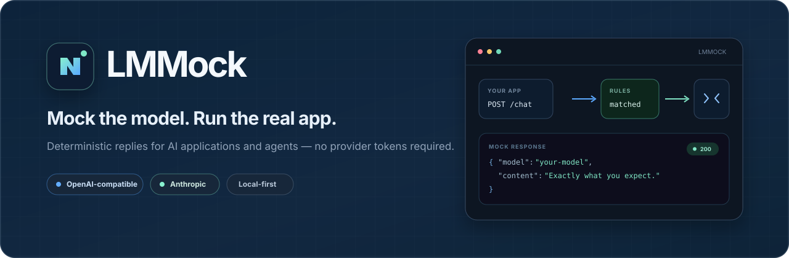

<p align="center">
  
</p>

<p align="center">A visual mock server for OpenAI and Anthropic APIs.</p>

<p align="center">
  <a href="README.md">English</a> · <a href="README.zh-CN.md">简体中文</a>
</p>

<p align="center">
  <a href="https://github.com/lewismosciski/LMMOCK/actions/workflows/ci.yml"></a>
  <a href="https://github.com/lewismosciski/LMMOCK/releases"></a>
  <a href="LICENSE"></a>
  
</p>

LMMock gives AI applications deterministic model replies without changing their SDK calls. Configure models, interfaces, behavior groups, and rules in the browser, then run the real application without provider tokens.

## Quick start

```bash
git clone https://github.com/lewismosciski/LMMOCK.git
cd LMMOCK
python3 run.py                  # Windows: py run.py
```

Or use Docker:

```bash
docker run --rm -p 127.0.0.1:17321:17321 \
  -v lmmock-data:/data ghcr.io/lewismosciski/lmmock:latest
```

Open [http://127.0.0.1:17321](http://127.0.0.1:17321). Standalone Linux, macOS, and Windows builds are on the [Releases page](https://github.com/lewismosciski/LMMOCK/releases).

## Models, behavior groups, and rules

- **Models** keep the names already used by your application. Each model independently selects the OpenAI-compatible or Anthropic interface, its visible Mock API key, and one or more behavior groups.
- **Behavior groups** isolate reusable sets of rules, such as `happy-path`, `tool-calls`, and `failures`. A model may combine several groups.
- **Rules** belong to one group, can target exact model names or glob patterns such as `gpt-*`, and match every request, contained text, or a regular expression.

Rules from all groups assigned to the requested model participate by priority. To restrict one request to a single assigned group, send `x-lmmock-group: happy-path` or its numeric group ID.

New workspaces start with `gpt-5.6-sol` for the OpenAI-compatible interface and `claude-5-1-opus` for Anthropic. If a request omits `model`, LMMock uses the first configured model for that request's interface.

New workspaces include an editable `foolAI` example. A Chinese question such as `你吃饭了吗？` becomes the deterministic reply `我吃饭了！`. The same example is also available in the template list.

Rules can also return fresh random ASCII data at an exact size from 0 to 10 MB. Use the built-in **Large random data** template to test clients against large model responses. The Recent requests panel shows estimated input, output, and total token usage, including a per-model breakdown. Statistics live in memory and reset when the request list is cleared or the server restarts.

## Supported APIs

| Provider | Endpoint | JSON | Streaming | Tool calls |
| --- | --- | :---: | :---: | :---: |
| OpenAI-compatible | `POST /openai/v1/completions` | ✓ | ✓ | — |
| OpenAI-compatible | `POST /openai/v1/chat/completions` | ✓ | ✓ | ✓ |
| OpenAI-compatible | `POST /openai/v1/responses` | ✓ | ✓ | ✓ |
| OpenAI-compatible | `GET /openai/v1/models` | ✓ | — | — |
| Anthropic | `POST /anthropic/v1/messages` | ✓ | ✓ | ✓ |
| Anthropic | `POST /anthropic/v1/messages/count_tokens` | ✓ | — | — |
| Anthropic | `GET /anthropic/v1/models` | ✓ | — | — |

List configured models for each interface:

```bash
curl http://127.0.0.1:17321/openai/v1/models
curl http://127.0.0.1:17321/anthropic/v1/models
```

## SDK examples

```python
from openai import OpenAI

client = OpenAI(base_url="http://127.0.0.1:17321/openai/v1", api_key="mock")

client.completions.create(model="gpt-5.6-sol", prompt="hello")
client.chat.completions.create(
    model="gpt-5.6-sol",
    messages=[{"role": "user", "content": "hello"}],
)
client.responses.create(model="gpt-5.6-sol", input="hello")
client.models.list()
```

```python
from anthropic import Anthropic

client = Anthropic(base_url="http://127.0.0.1:17321/anthropic", api_key="mock")
client.messages.create(
    model="claude-5-1-opus",
    max_tokens=128,
    messages=[{"role": "user", "content": "hello"}],
)
client.models.list()
```

## Use with Claude Code

LMMock exposes Anthropic-format Messages and Models APIs. Configure the built-in Anthropic model `claude-5-1-opus` with API key `local-test-key`, point Claude Code to LMMock, enable gateway model discovery, then choose `claude-5-1-opus` from `/model`:

```bash
python3 run.py

export ANTHROPIC_BASE_URL="http://127.0.0.1:17321/anthropic"
export ANTHROPIC_AUTH_TOKEN="local-test-key"
export CLAUDE_CODE_ENABLE_GATEWAY_MODEL_DISCOVERY=1
claude
```

Run `/status` to verify the base URL. See Anthropic's [gateway connection documentation](https://code.claude.com/docs/en/llm-gateway-connect) for persistent configuration.

## Use with Codex CLI

Add a custom provider to your user-level `~/.codex/config.toml`:

```toml
model = "gpt-5.6-sol"
model_provider = "lmmock"

[model_providers.lmmock]
name = "LMMock"
base_url = "http://127.0.0.1:17321/openai/v1"
env_key = "LMMOCK_API_KEY"
wire_api = "responses"
```

Set the `gpt-5.6-sol` row's API key to `local-test-key` in Configuration. The environment variable below is read by Codex because `env_key` points to it; LMMock checks it against that model's visible key:

```bash
export LMMOCK_API_KEY="local-test-key"
python3 run.py
codex
```

Codex provider settings belong in the user configuration, not a project-local file. See the official OpenAI documentation for [custom model providers](https://developers.openai.com/es-419/docs/config-file/config-advanced#proveedores-de-modelos-personalizados) and the [configuration reference](https://developers.openai.com/es-419/docs/config-file/config-reference).

## Mock multiple model backends

For an existing multi-agent application, keep every original model name and change only its base URL:

- OpenAI, DeepSeek, GLM, and other OpenAI-compatible clients: `http://127.0.0.1:17321/openai/v1`
- Claude or Anthropic clients: `http://127.0.0.1:17321/anthropic`

Add one Configuration row for every existing name—such as `gpt-4o`, `deepseek-chat`, `claude-3-7-sonnet`, and `glm-4-plus`. Select its interface, enter the key already used by that client (or leave it blank to accept any key), and check one or more behavior groups. Rules from those groups are combined by priority; their Models field can further narrow a rule with an exact name or comma-separated globs such as `gpt-*, o3-*`.

## Network access and API keys

Localhost is the safe default. To share LMMock on a trusted LAN, bind to all interfaces:

```bash
python3 run.py --host 0.0.0.0
```

Then open Configuration and optionally set a different Mock API key for each model. Keys are intentionally visible in the web UI and stored in the local SQLite database. They protect generation and token-count requests for their model; model discovery, the management UI, and management API remain open. Read [SECURITY.md](SECURITY.md) before exposing the server.

## Contributing

Contributions of every size are very welcome. Issues and pull requests are always appreciated—see [CONTRIBUTING.md](CONTRIBUTING.md).

## License

MIT
