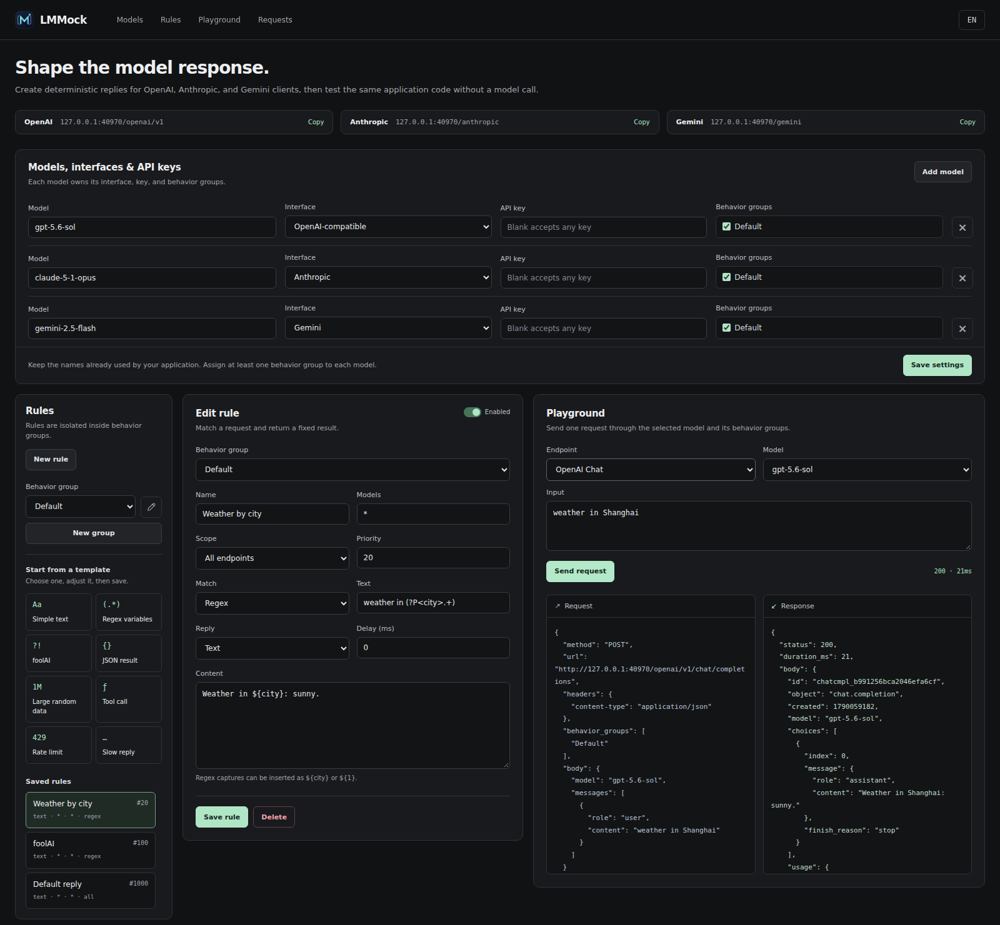

<p align="center">
  
</p>

<p align="center">A visual mock server for OpenAI, Anthropic, and Gemini APIs.</p>

<p align="center">
  <a href="README.md">English</a> · <a href="README.zh-CN.md">简体中文</a>
</p>

<p align="center">
  <a href="https://github.com/lewismosciski/LMMOCK/actions/workflows/ci.yml"></a>
  <a href="https://github.com/lewismosciski/LMMOCK/releases"></a>
  <a href="LICENSE"></a>
  
</p>

LMMock gives AI applications deterministic model replies without changing their SDK calls. Configure models, interfaces, behavior groups, and rules in the browser, then run the real application without provider tokens.

- **Lightweight:** one local service with SQLite storage and no external infrastructure.
- **Easy to use:** configure models and reusable rules in the browser, then change only your SDK Base URL.
- **Broadly compatible:** mock OpenAI Chat Completions, Completions, Responses, Anthropic Messages, and Gemini Generate Content.
- **Cross-platform:** run from source, Docker, or a Linux, macOS, or Windows release archive.
- **No provider cost:** deterministic testing without real API calls or tokens.

## Quick start

### Release archive (no Python required)

Download the archive for your system from [Releases](https://github.com/lewismosciski/LMMOCK/releases), extract it, run `lmmock` (`lmmock.exe` on Windows), then open [http://127.0.0.1:17321](http://127.0.0.1:17321).

### From source

```bash
git clone https://github.com/lewismosciski/LMMOCK.git
cd LMMOCK
python3 run.py
```

### Docker

```bash
docker run --rm -p 127.0.0.1:17321:17321 \
  -v lmmock-data:/data ghcr.io/lewismosciski/lmmock:latest
```

## Models, behavior groups, and rules

You only need to configure a model, add a rule, and point your application's SDK to LMMock.

<p align="center"></p>

1. In **Models, interfaces & API keys**, keep the model name used by your app, choose OpenAI-compatible, Anthropic, or Gemini, and assign one or more behavior groups.
2. In **Rules**, select a template or define what to match and what LMMock should return. Rules can return text, JSON, tool calls, errors, or exact-size random data.
3. Change the SDK Base URL: use `http://127.0.0.1:17321/openai/v1`, `http://127.0.0.1:17321/anthropic`, or `http://127.0.0.1:17321/gemini` for the corresponding client.

Use the Playground to try a rule immediately, with the request and response side by side. Recent requests shows the full request, response, and estimated token usage. The workspace starts in English with a dark theme; use **EN** to switch languages.

Regex matching has a 50 ms budget per request. Rules that time out are skipped; text and fallback rules can still match.
JSON request bodies are limited to 16 MiB, including chunked uploads.

## Supported APIs

| Provider | Endpoint | JSON | Streaming | Tool calls |
| --- | --- | :---: | :---: | :---: |
| OpenAI-compatible | `POST /openai/v1/completions` | ✓ | ✓ | — |
| OpenAI-compatible | `POST /openai/v1/chat/completions` | ✓ | ✓ | ✓ |
| OpenAI-compatible | `POST /openai/v1/responses` | ✓ | ✓ | ✓ |
| OpenAI-compatible | `GET /openai/v1/models` | ✓ | — | — |
| Anthropic | `POST /anthropic/v1/messages` | ✓ | ✓ | ✓ |
| Anthropic | `POST /anthropic/v1/messages/count_tokens` | ✓ | — | — |
| Anthropic | `GET /anthropic/v1/models` | ✓ | — | — |
| Gemini | `POST /gemini/v1beta/models/{model}:generateContent` | ✓ | — | ✓ |
| Gemini | `POST /gemini/v1beta/models/{model}:streamGenerateContent` | ✓ | ✓ | ✓ |
| Gemini | `POST /gemini/v1beta/models/{model}:countTokens` | ✓ | — | — |
| Gemini | `GET /gemini/v1beta/models` | ✓ | — | — |
| Gemini | `GET /gemini/v1beta/models/{model}` | ✓ | — | — |

List configured models for each interface:

```bash
curl http://127.0.0.1:17321/openai/v1/models
curl http://127.0.0.1:17321/anthropic/v1/models
curl http://127.0.0.1:17321/gemini/v1beta/models
```

## SDK examples

Runnable examples for OpenAI, Anthropic, and Gemini are in [`examples/`](examples/README.md). They use the official Python SDKs and connect only to your local LMMock server by default.

### Gemini

Add your model (for example, `gemini-2.5-flash`) in the UI, select **Gemini**, and assign a behavior group. With `google-genai` installed:

```python
from google import genai
from google.genai import types

with genai.Client(
    vertexai=False,
    api_key="mock",
    http_options=types.HttpOptions(
        base_url="http://127.0.0.1:17321/gemini", api_version="v1beta"
    ),
) as client:
    print(client.models.generate_content(model="gemini-2.5-flash", contents="Hello").text)
```

Use the model's configured key if you set one. Gemini accepts `x-goog-api-key` or `?key=`. Streaming uses `:streamGenerateContent?alt=sse`; token counts are estimates. This covers text and function-call mocks through the Gemini Developer API, not Vertex AI, Live, files, or media generation.

## Use with Claude Code

LMMock exposes Anthropic-format Messages and Models APIs. Configure the built-in Anthropic model `claude-5-1-opus` with API key `local-test-key`, point Claude Code to LMMock, enable gateway model discovery, then choose `claude-5-1-opus` from `/model`:

```bash
python3 run.py

export ANTHROPIC_BASE_URL="http://127.0.0.1:17321/anthropic"
export ANTHROPIC_AUTH_TOKEN="local-test-key"
export CLAUDE_CODE_ENABLE_GATEWAY_MODEL_DISCOVERY=1
claude
```

Run `/status` to verify the base URL. See Anthropic's [gateway connection documentation](https://code.claude.com/docs/en/llm-gateway-connect) for persistent configuration.

## Use with Codex CLI

Add a custom provider to your user-level `~/.codex/config.toml`:

```toml
model = "gpt-5.6-sol"
model_provider = "lmmock"

[model_providers.lmmock]
name = "LMMock"
base_url = "http://127.0.0.1:17321/openai/v1"
env_key = "LMMOCK_API_KEY"
wire_api = "responses"
```

Set the `gpt-5.6-sol` row's API key to `local-test-key` in Configuration. The environment variable below is read by Codex because `env_key` points to it; LMMock checks it against that model's visible key:

```bash
export LMMOCK_API_KEY="local-test-key"
python3 run.py
codex
```

Codex provider settings belong in the user configuration, not a project-local file. See the official OpenAI documentation for [custom model providers](https://developers.openai.com/es-419/docs/config-file/config-advanced#proveedores-de-modelos-personalizados) and the [configuration reference](https://developers.openai.com/es-419/docs/config-file/config-reference).

## Mock multiple model backends

For an existing multi-agent application, keep every original model name and change only its base URL:

- OpenAI, DeepSeek, GLM, and other OpenAI-compatible clients: `http://127.0.0.1:17321/openai/v1`
- Claude or Anthropic clients: `http://127.0.0.1:17321/anthropic`
- Native Gemini clients (`v1beta`): `http://127.0.0.1:17321/gemini`

Add one Configuration row for every existing name—such as `gpt-4o`, `deepseek-chat`, `claude-3-7-sonnet`, and `glm-4-plus`. Select its interface, enter the key already used by that client (or leave it blank to accept any key), and check one or more behavior groups. Rules from those groups are combined by priority; their Models field can further narrow a rule with an exact name or comma-separated globs such as `gpt-*, o3-*`.

## Network access and API keys

Localhost is the safe default. To share LMMock on a trusted LAN, bind to all interfaces:

```bash
python3 run.py --host 0.0.0.0
```

Then open Configuration and optionally set a different Mock API key for each model. Keys are intentionally visible in the web UI and stored in the local SQLite database. They protect generation and token-count requests for their model; model discovery, the management UI, and management API remain open.

The UI rejects cross-origin management writes. This is not authentication: only expose the service on trusted networks.

## Contributing

Contributions of every size are very welcome. Issues and pull requests are always appreciated—see [CONTRIBUTING.md](CONTRIBUTING.md).

## Friends

- [LINUX DO](https://linux.do/)

## License

MIT
